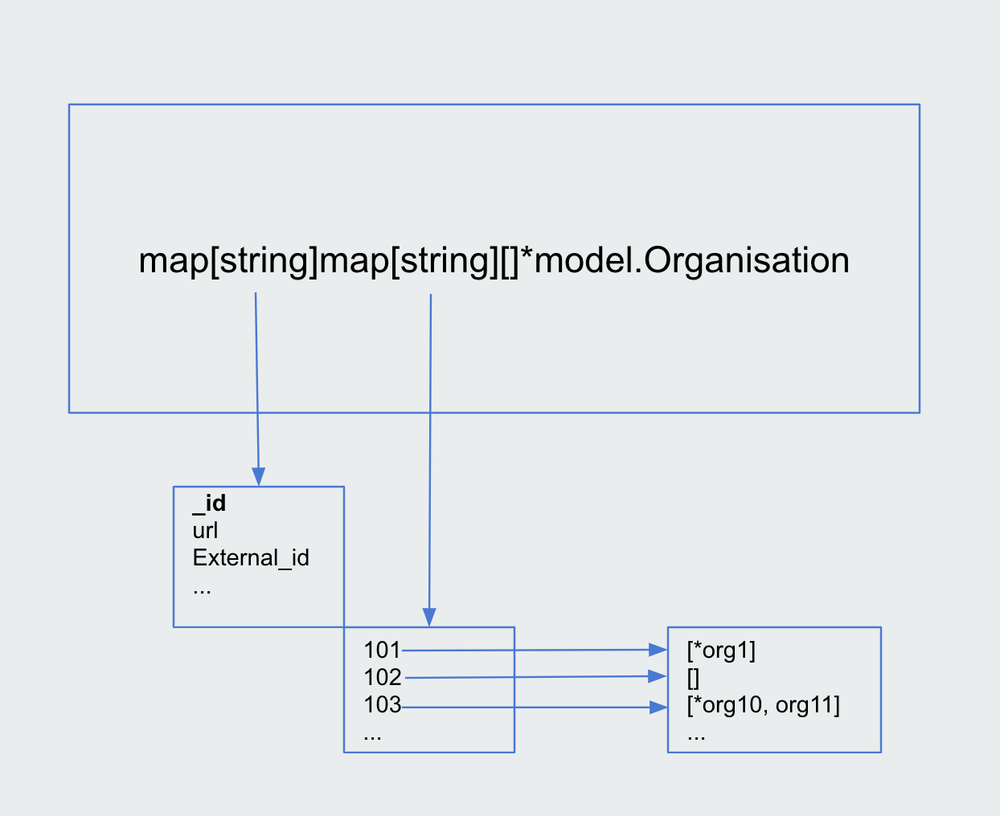

# Zendesk Code Challenge

[](https://github.com/wahyd4/zendesk/actions)


## How to

### How to run

```bash

./auto/run

```

Or without Docker

```bash

go run main.go

```

Please use your arrow keys to select search data type and field name from all fields, then type the value for that field.

If there are something matched, the application will printed out all the information, including linked `User` and `Organisation` information.

Otherwise you should expect a error message says `Cannot find any matched result`

    Notice: Due to the limited time, currently you can't go back in the CLI, if you want to skip the current search then just type `Enter`.

###  How to test

```bash

./auto/test

```

Or without Docker

```bash

go test ./... -cover

```

### How to build Docker image

```bash

GITHUB_RUN_NUMBER=1 ./auto/build

```

## How does the application work

The application loads `organisations`, `users` and `tickets` from json into memory, then puts them into models and sets up the relationships between models. For instance the `organisation` property in a `user` model.

For the search part, in order to provide a better performance(which the time complexity for searching is `O(1)` ) the `BuildIndexes()` method will scan every model item and every field in that model to build a index map with two levels.

For example the index map for `organisations` looks like:



In first level the key is the field name, the value for the key is a another map, which each key presents one uniq value for that field, and the value is a array of all the matched model reference(pointer).

Besides, I also created a `SearchIndex` to present one type of model which can be searched. So we end up with having `3` different indexes which implement `ListSearchableFields` and `Search` method for each model type. It decouples the logic and decreases the duplication.


Last but not least, the `Search()` method will delegate the call the one `SearchIndex` and print out all the matched results.


## Assumptions

- All the data in json is valid, for example no invalid `organisation_id` in `users.json`


## Highlights

- Had basic CI(Github workflow) pipeline setup
- Containerised Application
- Created indexes for all entities and fields, after all the entities been scanned, no matter how many items we have, the search time complexity is always O(1).
- Used [table driven test](https://github.com/golang/go/wiki/TableDrivenTests)


## If I had more time / What can I improve

- Better object printing instead of using `spew.Dump()`
- Reuse more shard logic especially in `search/index.go`, but due to Go missing generics concept it's different when compare to `Ruby`, `Java` and some other popular languages.
- Add more tests, due to this code test costs me a lot of time to complete, so I didn't cover all the code currently, but I am keen to add more tests if possible.
- Better user experience in CLI application, current the cli app is very basic and go can't go back to previous menu.
